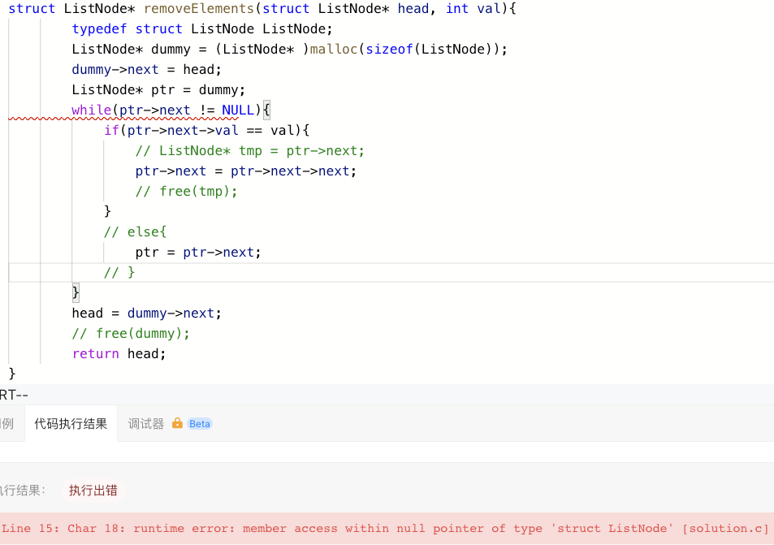

# List basic


## List property


## Practice reflect

### C 内存管理

反思：还是`C`用的不熟练，对于基本的内存管理要`free()`掉不清楚，记住正确的形式，如下

```c
/**
 * Definition for singly-linked list.
 * struct ListNode {
 *     int val;
 *     struct ListNode *next;
 * };
 */


struct ListNode* removeElements(struct ListNode* head, int val){
        typedef struct ListNode ListNode;// this kind of technique should remember!
        ListNode* dummy = (ListNode* )malloc(sizeof(ListNode));// be familiar with the malloc function and usage!
        dummy->next = head;
        ListNode* ptr = dummy;
        while(ptr->next != NULL){
            if(ptr->next->val == val){
                ListNode* tmp = ptr->next;// copy node
                ptr->next = ptr->next->next;
                free(tmp);// free node
            }
            else{
                ptr = ptr->next;
            }
        }
        head = dummy->next;//copy dummy node
        free(dummy);//free dummy node
        return head;
}
```

- `C`中的新建一个节点和删除一个节点，都不是`Java`里有自动的机制的
  - **新建存放的内存空间**`(Datatype) malloc(sizeof(Datatype))`
  - **回收防止内存泄漏**`free(Datatype instance)`

- 知道为什么犯了这样的错误很重要,这个和`nullPointError`是一样的

  